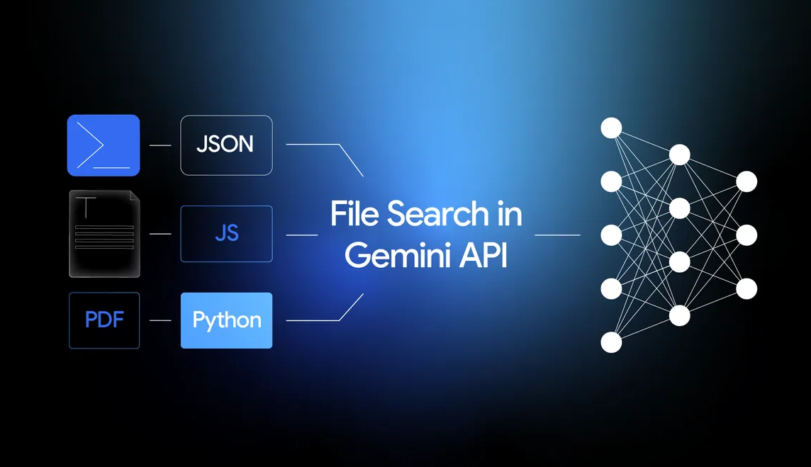
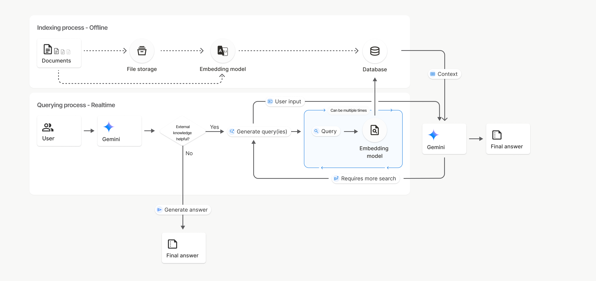

# MicroTutor AI 📘

An intelligent learning system powered by Google Gemini File Search API that provides RAG-based tutoring, flashcards, quizzes, and study schedules from your PDF documents.

## 📸 Screenshots

### PDF Upload & Indexing

*Upload and index PDF documents for processing. The interface shows real-time status updates during indexing and displays all indexed PDFs with their store IDs.*

### Visual Study Schedule Generator

*Generate intelligent, multi-day study schedules from uploaded PDFs. Each day includes session titles, summaries, and page references to guide your learning.*

### Interactive Flashcards

*Create and study with interactive flashcards. Navigate through cards, flip to see answers, and review key concepts from your PDFs.*

## 🚀 Quick Start

### Prerequisites
- Python 3.8+
- Virtual environment (venv)
- API Keys:
  - **GEMINI_API_KEY** (Required) - Get from [Google AI Studio](https://makersuite.google.com/app/apikey)
  - OPENAI_API_KEY (Optional) - For mem0 memory features
  - MEM0_API_KEY (Optional) - For mem0 memory features

### Setup (Windows PowerShell)

1. **Activate your virtual environment:**
   ```powershell
   .\.venv\Scripts\Activate.ps1
   ```

2. **Run the setup script:**
   ```powershell
   .\setup.ps1
   ```
   
   Or manually install dependencies:
   ```powershell
   pip install -r requirements.txt
   ```

3. **Configure API keys:**
   
   Create a `.env` file in the project root:
   ```env
   GEMINI_API_KEY=your_gemini_api_key_here
   OPENAI_API_KEY=your_openai_api_key_here  # Optional
   MEM0_API_KEY=your_mem0_api_key_here      # Optional
   ```
   
   Or use `env_template.txt` as a template.

4. **Run the application:**
   ```powershell
   python app.py
   ```

5. **Access the UI:**
   - The Gradio interface will open in your browser automatically
   - Or visit the URL shown in the terminal (usually `http://127.0.0.1:7860`)

## 📋 Features

- **📄 PDF Upload & Indexing**: Upload multiple PDFs and index them using Gemini File Search
- **🤖 RAG Tutor Chat**: Ask questions and get answers with page citations
- **📅 Intelligent Study Schedule**: Generate personalized study schedules from your PDFs
- **🃏 Flashcards**: Generate interactive flashcards for any topic
- **📝 Interactive Quiz**: Create and take quizzes with immediate feedback
- **🧠 Learning Memory**: Track your progress with mem0

## 🏗️ Architecture

### System Overview
```
MicroTutor
├── app.py                    # Entry point
├── core/
│   ├── file_search.py       # Gemini File Search integration
│   ├── page_map.py          # PDF page mapping
│   ├── tutor.py             # RAG tutor assistant
│   ├── schedule.py          # Study schedule generator
│   ├── flashcards.py        # Flashcard generator
│   ├── quiz.py              # Quiz generator
│   └── memory.py            # Memory manager (mem0)
└── ui/
    └── interface.py         # Gradio UI
```

### Gemini File Search Integration


*Gemini File Search API supports multiple input formats (JSON, JavaScript, Python) and processes PDF documents through advanced neural network models for intelligent content understanding and retrieval.*

### RAG Architecture (Indexing & Querying)


*The RAG (Retrieval-Augmented Generation) architecture used by MicroTutor:*
- **Indexing Process (Offline)**: Documents are stored, embedded, and indexed in a vector database
- **Querying Process (Real-time)**: Gemini intelligently decides when to retrieve context from the knowledge base, generates search queries, and synthesizes answers with citations

## 🔧 Troubleshooting

### ModuleNotFoundError
If you get `ModuleNotFoundError`:
1. Ensure your virtual environment is activated (check for `(.venv)` in your prompt)
2. Run `pip install -r requirements.txt` inside the venv
3. Or run `.\setup.ps1` to automate setup

### API Key Errors
- Ensure `.env` file exists in the project root
- Check that `GEMINI_API_KEY` is set correctly
- Verify API keys are valid and have proper permissions

### Import Errors
- Make sure you're using the Python from your venv:
  ```powershell
  python -c "import sys; print(sys.executable)"
  ```
- Should show path to `.venv\Scripts\python.exe`

## 📝 Requirements

See `requirements.txt` for full dependency list:
- `google-generativeai` - Gemini API client
- `gradio` - Web UI framework
- `pymupdf` - PDF processing
- `mem0ai` - Memory/persistence (optional)
- `python-dotenv` - Environment variable management

## 📄 License

MIT License

